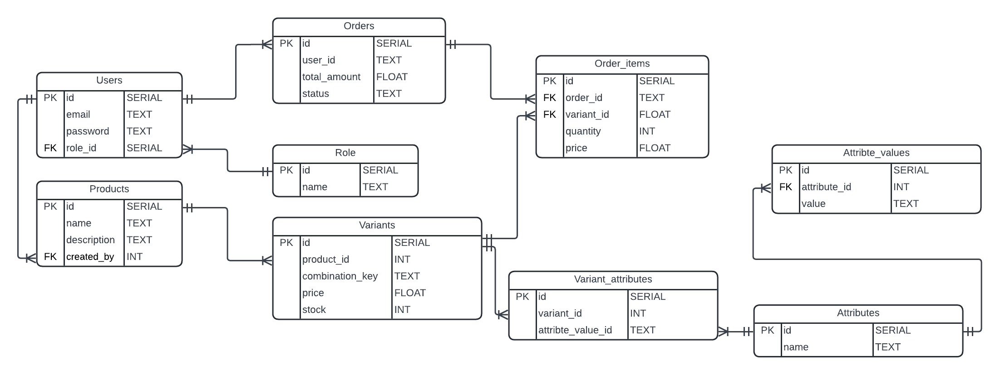

# MO Marketplace Backend - API Documentation

## Table of Contents

1. Project Overview
2. Setup Instructions
3. Assumptions
4. Database Migrations
5. API Summary
6. Running the Application

---

## Project Overview

MO Marketplace Backend is a NestJS based REST API for a marketplace platform.

### Core Features

- User Authentication (Registration, Login with JWT)
- Admin Management and Role-Based Access
- Product Management (Create, Update, Delete)
- Product Variants with Attributes
- Dynamic Attributes and Values
- Variant Filtering by Attributes
- Order Management with Stock Validation
- Complete API Documentation (Swagger/OpenAPI)
- Input Validation with User-Friendly Messages
- PostgreSQL Database with TypeORM

### Tech Stack

- Framework: NestJS 11.0.1
- Database: PostgreSQL
- ORM: TypeORM 0.3.28
- Authentication: JWT with Passport
- Validation: class-validator 0.15.1
- Password Hashing: bcrypt 6.0.0
- API Documentation: Swagger/OpenAPI 3.0
- Language: TypeScript

---

## Database Schema



---

## Setup Instructions

### Prerequisites

- Node.js v18+ LTS
- npm v9+
- PostgreSQL v12+

### Step 1: Install Dependencies

```bash
npm install
```

### Step 2: Create .env File

Create `.env` in the root directory:

```env
NODE_ENV=development
PORT=3000

DB_TYPE=postgres
DB_HOST=localhost
DB_PORT=5432
DB_USERNAME=postgres
DB_PASSWORD=your_password
DB_DATABASE=mo_marketplace

JWT_SECRET=your_super_secret_jwt_key_change_in_production
JWT_EXPIRATION=24h

CORS_ORIGIN=http://localhost:3000,http://localhost:3001,http://localhost:5173

SWAGGER_PATH=/api-docs
```

### Step 3: Start Development Server

```bash
npm run start:dev
```

Server runs at: http://localhost:3000
Swagger UI: http://localhost:3000/api-docs
API Response Handler: http://localhost:3000/api

### Step 6: Test Endpoints

Import `postman_collection.json` into Postman or use Swagger UI at http://localhost:3000/api-docs

---

## Assumptions

### Data Model

- One User creates many Products
- One Product has many Variants
- One Product has many OrderItems
- One Attribute has many AttributeValues
- One Variant has many VariantAttributes

### User Roles

- Two roles: user (role_id=2) and admin (role_id=1)
- Admin: Create/modify products, attributes, manage inventory
- User: Create orders, view products

### Variant Management

- Combination key uses alphabetically sorted attribute values
- Example: "red-M-cotton" (unique per product)
- Prevents duplicate variants

### Stock Management

- Tracked at variant level
- Auto decrements on order creation
- Admin updates via PATCH endpoint

### Authentication

- JWT token issued on register and login
- Token expiration: 24 hours (configurable)
- Used for protected endpoints

### Public Access

- Products listing: No authentication required
- Variant browsing: No authentication required
- Filtering: No authentication required
- Registration and login: No authentication required

### Validation

- Passwords: Minimum 6 characters
- Email: Valid email format required
- Password hashing: bcrypt (10 rounds)

---

## Included Database Migrations

These migrations automatically run when the server start.

1. 1704067200000-CreateInitialTables.ts
   - Creates users, roles, products, variants, attributes
   - Creates order tables

2. 1704153600000-SeedInitialData.ts
   - Seeds initial roles (user, admin)
   - Creates sample admin user

---

## API Summary

Total Endpoints: 29
Public Endpoints: 5
Protected Endpoints: 24
Admin-Only Endpoints: 12

View full API documentation at: /api-docs (when running)

---

## Running the Application

```bash
# 1. Install
npm install

# 2. Configure
# Create .env with database credentials

# 3. Setup Database
npm run migration:run

# 4. Run
npm run start:dev

# 5. Test
# Visit http://localhost:3000/api-docs
```

API Available: http://localhost:3000
Documentation: http://localhost:3000/api-docs

---

Last Updated: April 5, 2026
Status: Complete and Ready
